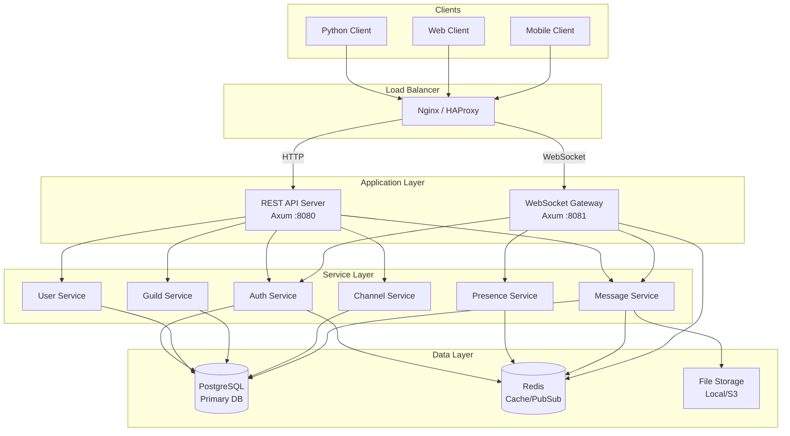

# System Architecture

## Discord-like Chat Server - Architecture Overview

This document provides comprehensive architecture diagrams and component descriptions for the chat server system.

---

## Table of Contents

1. [High-Level Architecture](#high-level-architecture)
2. [Component Architecture](#component-architecture)
3. [Data Flow Diagrams](#data-flow-diagrams)
4. [Technology Stack](#technology-stack)
5. [Deployment Architecture](#deployment-architecture)
6. [Scalability Considerations](#scalability-considerations)

---

## High-Level Architecture

### System Overview (Mermaid)



### ASCII Architecture Diagram

```
┌──────────────────────────────────────────────────────────────────────────┐
│                              CLIENTS                                      │
│  ┌─────────────┐  ┌─────────────┐  ┌─────────────┐  ┌─────────────┐     │
│  │   Python    │  │    Web      │  │   Mobile    │  │    Bot      │     │
│  │   Client    │  │   Client    │  │   Client    │  │   Client    │     │
│  └──────┬──────┘  └──────┬──────┘  └──────┬──────┘  └──────┬──────┘     │
└─────────┼────────────────┼────────────────┼────────────────┼─────────────┘
          │                │                │                │
          └────────────────┴────────┬───────┴────────────────┘
                                    │
                            ┌───────▼───────┐
                            │ Load Balancer │
                            │ (Nginx/HAProxy)│
                            └───────┬───────┘
                                    │
                    ┌───────────────┴───────────────┐
                    │                               │
            ┌───────▼───────┐               ┌───────▼───────┐
            │   REST API    │               │   WebSocket   │
            │   Server      │               │   Gateway     │
            │  (Axum:8080)  │               │  (Axum:8081)  │
            └───────┬───────┘               └───────┬───────┘
                    │                               │
┌───────────────────┴───────────────────────────────┴───────────────────────┐
│                          SERVICE LAYER                                     │
│  ┌──────────┐ ┌──────────┐ ┌──────────┐ ┌──────────┐ ┌──────────┐        │
│  │   Auth   │ │   User   │ │  Guild   │ │ Channel  │ │ Message  │        │
│  │ Service  │ │ Service  │ │ Service  │ │ Service  │ │ Service  │        │
│  └────┬─────┘ └────┬─────┘ └────┬─────┘ └────┬─────┘ └────┬─────┘        │
│       │            │            │            │            │               │
│  ┌────┴────────────┴────────────┴────────────┴────────────┴────┐         │
│  │                    Permission Service                        │         │
│  └──────────────────────────────────────────────────────────────┘         │
└───────────────────────────────────┬───────────────────────────────────────┘
                                    │
┌───────────────────────────────────┴───────────────────────────────────────┐
│                       INFRASTRUCTURE LAYER                                 │
│                                                                            │
│  ┌────────────────┐  ┌────────────────┐  ┌────────────────┐               │
│  │   PostgreSQL   │  │     Redis      │  │  File Storage  │               │
│  │   ─────────    │  │   ─────────    │  │   ─────────    │               │
│  │  • Users       │  │  • Sessions    │  │  • Attachments │               │
│  │  • Guilds      │  │  • Presence    │  │  • Avatars     │               │
│  │  • Channels    │  │  • Typing      │  │  • Icons       │               │
│  │  • Messages    │  │  • Pub/Sub     │  │                │               │
│  │  • Roles       │  │  • Rate Limit  │  │                │               │
│  │  • Audit Logs  │  │                │  │                │               │
│  └────────────────┘  └────────────────┘  └────────────────┘               │
│                                                                            │
└────────────────────────────────────────────────────────────────────────────┘
```

---

## Component Architecture

### REST API Server (chat-api)

```
┌─────────────────────────────────────────────────────────────────┐
│                       chat-api (Axum)                            │
├─────────────────────────────────────────────────────────────────┤
│                                                                  │
│  ┌──────────────────────────────────────────────────────────┐   │
│  │                     Middleware Stack                      │   │
│  │  ┌────────┐ ┌────────┐ ┌────────┐ ┌────────┐ ┌────────┐ │   │
│  │  │ Trace  │→│  CORS  │→│  Auth  │→│Rate Lim│→│Compress│ │   │
│  │  └────────┘ └────────┘ └────────┘ └────────┘ └────────┘ │   │
│  └──────────────────────────────────────────────────────────┘   │
│                              │                                   │
│  ┌──────────────────────────────────────────────────────────┐   │
│  │                       Router                              │   │
│  │                                                           │   │
│  │  /api/v1/auth/*     → AuthHandler                        │   │
│  │  /api/v1/users/*    → UserHandler                        │   │
│  │  /api/v1/guilds/*   → GuildHandler                       │   │
│  │  /api/v1/channels/* → ChannelHandler                     │   │
│  │  /api/v1/invites/*  → InviteHandler                      │   │
│  │  /health/*          → HealthHandler                      │   │
│  │                                                           │   │
│  └──────────────────────────────────────────────────────────┘   │
│                              │                                   │
│  ┌──────────────────────────────────────────────────────────┐   │
│  │                    Extractors                             │   │
│  │  ┌─────────────┐ ┌─────────────┐ ┌─────────────┐        │   │
│  │  │CurrentUser  │ │ Pagination  │ │ValidatedJson│        │   │
│  │  └─────────────┘ └─────────────┘ └─────────────┘        │   │
│  └──────────────────────────────────────────────────────────┘   │
│                              │                                   │
│  ┌──────────────────────────────────────────────────────────┐   │
│  │                  Application State                        │   │
│  │  ┌───────────┐ ┌───────────┐ ┌───────────┐               │   │
│  │  │  PgPool   │ │RedisPool  │ │ Services  │               │   │
│  │  └───────────┘ └───────────┘ └───────────┘               │   │
│  └──────────────────────────────────────────────────────────┘   │
│                                                                  │
└─────────────────────────────────────────────────────────────────┘
```

### WebSocket Gateway (chat-gateway)

```
┌─────────────────────────────────────────────────────────────────┐
│                    chat-gateway (Axum)                           │
├─────────────────────────────────────────────────────────────────┤
│                                                                  │
│  ┌──────────────────────────────────────────────────────────┐   │
│  │                  Connection Manager                       │   │
│  │  ┌─────────────────────────────────────────────────────┐ │   │
│  │  │              Active Connections (DashMap)           │ │   │
│  │  │  ┌─────────┐ ┌─────────┐ ┌─────────┐ ┌─────────┐  │ │   │
│  │  │  │Session 1│ │Session 2│ │Session 3│ │   ...   │  │ │   │
│  │  │  └─────────┘ └─────────┘ └─────────┘ └─────────┘  │ │   │
│  │  └─────────────────────────────────────────────────────┘ │   │
│  └──────────────────────────────────────────────────────────┘   │
│                              │                                   │
│  ┌──────────────────────────────────────────────────────────┐   │
│  │                   Message Router                          │   │
│  │                                                           │   │
│  │  Op 1 (Heartbeat)       → HeartbeatHandler               │   │
│  │  Op 2 (Identify)        → IdentifyHandler                │   │
│  │  Op 3 (Presence Update) → PresenceHandler                │   │
│  │  Op 4 (Resume)          → ResumeHandler                  │   │
│  │                                                           │   │
│  └──────────────────────────────────────────────────────────┘   │
│                              │                                   │
│  ┌──────────────────────────────────────────────────────────┐   │
│  │                  Event Dispatcher                         │   │
│  │  ┌─────────────────────────────────────────────────────┐ │   │
│  │  │           Redis Pub/Sub Subscriber                  │ │   │
│  │  │  • guild:{guild_id}   → Broadcast to guild members  │ │   │
│  │  │  • channel:{ch_id}    → Broadcast to channel        │ │   │
│  │  │  • user:{user_id}     → Direct to user sessions     │ │   │
│  │  └─────────────────────────────────────────────────────┘ │   │
│  └──────────────────────────────────────────────────────────┘   │
│                              │                                   │
│  ┌──────────────────────────────────────────────────────────┐   │
│  │                    Broadcaster                            │   │
│  │  • Guild broadcast (all members)                         │   │
│  │  • Channel broadcast (permission-filtered)               │   │
│  │  • User broadcast (all user sessions)                    │   │
│  └──────────────────────────────────────────────────────────┘   │
│                                                                  │
└─────────────────────────────────────────────────────────────────┘
```

### Session State Machine

```
┌─────────────────────────────────────────────────────────────────┐
│                    Session State Machine                         │
├─────────────────────────────────────────────────────────────────┤
│                                                                  │
│    ┌──────────┐         Hello           ┌──────────────┐        │
│    │Connected │ ───────────────────────→│Awaiting Auth │        │
│    └──────────┘                          └──────────────┘        │
│                                                 │                │
│                                     ┌───────────┴───────────┐   │
│                                     │                       │   │
│                               Identify                  Resume  │
│                                     │                       │   │
│                                     ▼                       ▼   │
│                           ┌──────────────┐        ┌───────────┐ │
│                           │Authenticated │        │ Resuming  │ │
│                           └──────────────┘        └───────────┘ │
│                                     │                       │   │
│                                     │         ┌─────────────┘   │
│                                     │         │                 │
│                                     ▼         ▼                 │
│                           ┌────────────────────┐                │
│                           │       Ready        │◄───────────┐   │
│                           └────────────────────┘            │   │
│                                     │                       │   │
│                     ┌───────────────┼───────────────┐       │   │
│                     │               │               │       │   │
│                     ▼               ▼               ▼       │   │
│              ┌───────────┐   ┌───────────┐   ┌───────────┐ │   │
│              │ Receiving │   │  Sending  │   │Heartbeat  │ │   │
│              │  Events   │   │  Events   │   │   Loop    │ │   │
│              └───────────┘   └───────────┘   └───────────┘ │   │
│                     │               │               │       │   │
│                     └───────────────┴───────────────┘       │   │
│                                     │                       │   │
│                          ┌──────────┴──────────┐            │   │
│                          │                     │            │   │
│                    Reconnect              Disconnect        │   │
│                          │                     │            │   │
│                          ▼                     ▼            │   │
│                 ┌──────────────┐       ┌───────────┐        │   │
│                 │Disconnected  │       │  Closed   │        │   │
│                 │(Resumable)   │       │(Terminal) │        │   │
│                 └──────────────┘       └───────────┘        │   │
│                          │                                  │   │
│                     (2 min TTL)                             │   │
│                          │                                  │   │
│                          └──────────────────────────────────┘   │
│                                                                  │
└─────────────────────────────────────────────────────────────────┘
```

---

## Data Flow Diagrams

### Message Creation Flow

```
┌─────────────────────────────────────────────────────────────────┐
│                    Message Creation Flow                         │
├─────────────────────────────────────────────────────────────────┤
│                                                                  │
│  Client                API Server              Database          │
│    │                       │                       │             │
│    │  POST /messages       │                       │             │
│    │──────────────────────>│                       │             │
│    │                       │                       │             │
│    │                       │  1. Validate request  │             │
│    │                       │  2. Check permissions │             │
│    │                       │                       │             │
│    │                       │  INSERT message       │             │
│    │                       │──────────────────────>│             │
│    │                       │                       │             │
│    │                       │  message_id           │             │
│    │                       │<──────────────────────│             │
│    │                       │                       │             │
│    │  201 Created          │                       │             │
│    │<──────────────────────│                       │             │
│    │                       │                       │             │
│    │                       │                       │             │
│                                                                  │
│  Redis Pub/Sub                                   Gateway         │
│    │                                                │            │
│    │  PUBLISH channel:{id}                          │            │
│    │  {MESSAGE_CREATE event}                        │            │
│    │<───────────────────────────────────────────────│            │
│    │                                                │            │
│    │  Broadcast to subscribers                      │            │
│    │────────────────────────────────────────────────>│           │
│    │                                                │            │
│    │                                                │            │
│                                                                  │
│  Gateway                                     Connected Clients   │
│    │                                                │            │
│    │  For each session in channel:                  │            │
│    │  - Check VIEW_CHANNEL permission              │            │
│    │  - Send MESSAGE_CREATE event                  │            │
│    │                                                │            │
│    │  {"op":0,"t":"MESSAGE_CREATE","d":{...}}      │            │
│    │────────────────────────────────────────────────>│           │
│    │                                                │            │
│                                                                  │
└─────────────────────────────────────────────────────────────────┘
```

### Authentication Flow

```
┌─────────────────────────────────────────────────────────────────┐
│                    Authentication Flow                           │
├─────────────────────────────────────────────────────────────────┤
│                                                                  │
│    ┌────────────┐    ┌────────────┐    ┌────────────┐           │
│    │   Client   │    │  API Server│    │  Database  │           │
│    └─────┬──────┘    └─────┬──────┘    └─────┬──────┘           │
│          │                 │                 │                   │
│          │ POST /login     │                 │                   │
│          │ {email, pass}   │                 │                   │
│          │────────────────>│                 │                   │
│          │                 │                 │                   │
│          │                 │ SELECT user     │                   │
│          │                 │────────────────>│                   │
│          │                 │                 │                   │
│          │                 │ user record     │                   │
│          │                 │<────────────────│                   │
│          │                 │                 │                   │
│          │                 │ Verify password │                   │
│          │                 │ (argon2)        │                   │
│          │                 │                 │                   │
│          │                 │                 │                   │
│    ┌─────┴──────┐    ┌─────┴──────┐    ┌─────┴──────┐           │
│    │   Client   │    │  API Server│    │   Redis    │           │
│    └─────┬──────┘    └─────┬──────┘    └─────┬──────┘           │
│          │                 │                 │                   │
│          │                 │ Generate JWT    │                   │
│          │                 │ (access + refresh)                  │
│          │                 │                 │                   │
│          │                 │ SETEX refresh   │                   │
│          │                 │ token (7 days)  │                   │
│          │                 │────────────────>│                   │
│          │                 │                 │                   │
│          │ 200 OK          │                 │                   │
│          │ {access_token,  │                 │                   │
│          │  refresh_token} │                 │                   │
│          │<────────────────│                 │                   │
│          │                 │                 │                   │
│                                                                  │
└─────────────────────────────────────────────────────────────────┘
```

### Presence Update Flow

```
┌─────────────────────────────────────────────────────────────────┐
│                    Presence Update Flow                          │
├─────────────────────────────────────────────────────────────────┤
│                                                                  │
│  Client          Gateway           Redis           Other Clients │
│    │                │                │                │          │
│    │ Op 3: Presence │                │                │          │
│    │ {status:idle}  │                │                │          │
│    │───────────────>│                │                │          │
│    │                │                │                │          │
│    │                │ HSET presence: │                │          │
│    │                │ {user_id}      │                │          │
│    │                │ {status, ts}   │                │          │
│    │                │───────────────>│                │          │
│    │                │                │                │          │
│    │                │ For each guild │                │          │
│    │                │ user is in:    │                │          │
│    │                │                │                │          │
│    │                │ PUBLISH guild: │                │          │
│    │                │ {guild_id}     │                │          │
│    │                │───────────────>│                │          │
│    │                │                │                │          │
│    │                │                │ PRESENCE_UPDATE│          │
│    │                │                │ to subscribers │          │
│    │                │                │───────────────>│          │
│    │                │                │                │          │
│    │                │                │                │ Receive  │
│    │                │                │                │ PRESENCE │
│    │                │                │                │ _UPDATE  │
│    │                │                │                │          │
│                                                                  │
└─────────────────────────────────────────────────────────────────┘
```

---

## Technology Stack

### Component Technologies

```
┌─────────────────────────────────────────────────────────────────┐
│                    Technology Stack                              │
├─────────────────────────────────────────────────────────────────┤
│                                                                  │
│  ┌─────────────────────────────────────────────────────────┐    │
│  │                    Application Layer                     │    │
│  │                                                          │    │
│  │  Language:     Rust 1.82+                               │    │
│  │  Runtime:      Tokio 1.40+                              │    │
│  │  Web Framework: Axum 0.7+                                │    │
│  │  WebSocket:    tokio-tungstenite 0.28+                  │    │
│  │  Serialization: serde + serde_json                      │    │
│  │  Validation:   validator                                 │    │
│  │                                                          │    │
│  └─────────────────────────────────────────────────────────┘    │
│                                                                  │
│  ┌─────────────────────────────────────────────────────────┐    │
│  │                    Data Layer                            │    │
│  │                                                          │    │
│  │  Database:     PostgreSQL 16+                           │    │
│  │  DB Driver:    SQLx 0.8+ (async, compile-time checks)   │    │
│  │  Cache:        Redis 7+                                 │    │
│  │  Redis Driver: redis-rs 0.32+ with deadpool             │    │
│  │  Migrations:   sqlx-cli                                  │    │
│  │                                                          │    │
│  └─────────────────────────────────────────────────────────┘    │
│                                                                  │
│  ┌─────────────────────────────────────────────────────────┐    │
│  │                    Security                              │    │
│  │                                                          │    │
│  │  Password:     Argon2id (argon2 crate)                  │    │
│  │  JWT:          jsonwebtoken (RS256 or HS256)            │    │
│  │  TLS:          rustls                                    │    │
│  │  CORS:         tower-http                               │    │
│  │                                                          │    │
│  └─────────────────────────────────────────────────────────┘    │
│                                                                  │
│  ┌─────────────────────────────────────────────────────────┐    │
│  │                    Observability                         │    │
│  │                                                          │    │
│  │  Logging:      tracing + tracing-subscriber             │    │
│  │  Metrics:      prometheus (later phase)                 │    │
│  │  Tracing:      OpenTelemetry (later phase)              │    │
│  │                                                          │    │
│  └─────────────────────────────────────────────────────────┘    │
│                                                                  │
│  ┌─────────────────────────────────────────────────────────┐    │
│  │                    Infrastructure                        │    │
│  │                                                          │    │
│  │  Container:    Docker                                    │    │
│  │  Orchestration: Kubernetes (later phase)                │    │
│  │  Load Balancer: Nginx / HAProxy                         │    │
│  │  File Storage: Local FS → S3 (migration path)           │    │
│  │                                                          │    │
│  └─────────────────────────────────────────────────────────┘    │
│                                                                  │
└─────────────────────────────────────────────────────────────────┘
```

---

## Deployment Architecture

### Single Server (MVP)

```
┌─────────────────────────────────────────────────────────────────┐
│                    Single Server Deployment                      │
├─────────────────────────────────────────────────────────────────┤
│                                                                  │
│  ┌───────────────────────────────────────────────────────────┐  │
│  │                     Docker Host                            │  │
│  │                                                            │  │
│  │  ┌─────────────────────────────────────────────────────┐  │  │
│  │  │              Docker Compose Stack                    │  │  │
│  │  │                                                      │  │  │
│  │  │  ┌──────────┐  ┌──────────┐  ┌──────────┐          │  │  │
│  │  │  │  Nginx   │  │  Redis   │  │ PostgreSQL│          │  │  │
│  │  │  │  :80/443 │  │  :6379   │  │  :5432   │          │  │  │
│  │  │  └────┬─────┘  └────┬─────┘  └────┬─────┘          │  │  │
│  │  │       │             │             │                 │  │  │
│  │  │       │    ┌────────┴─────────────┘                 │  │  │
│  │  │       │    │                                        │  │  │
│  │  │       ▼    ▼                                        │  │  │
│  │  │  ┌─────────────────────────────────────────────┐   │  │  │
│  │  │  │         chat-server (single binary)          │   │  │  │
│  │  │  │                                              │   │  │  │
│  │  │  │  ┌──────────────┐  ┌──────────────┐         │   │  │  │
│  │  │  │  │   REST API   │  │   Gateway    │         │   │  │  │
│  │  │  │  │    :8080     │  │    :8081     │         │   │  │  │
│  │  │  │  └──────────────┘  └──────────────┘         │   │  │  │
│  │  │  │                                              │   │  │  │
│  │  │  └─────────────────────────────────────────────┘   │  │  │
│  │  │                                                      │  │  │
│  │  │  ┌──────────────────────────────────────────────┐  │  │  │
│  │  │  │              Shared Volume                    │  │  │  │
│  │  │  │  /data/uploads  (file attachments)           │  │  │  │
│  │  │  └──────────────────────────────────────────────┘  │  │  │
│  │  │                                                      │  │  │
│  │  └──────────────────────────────────────────────────────┘  │  │
│  │                                                            │  │
│  └───────────────────────────────────────────────────────────┘  │
│                                                                  │
└─────────────────────────────────────────────────────────────────┘
```

### Horizontally Scaled (Future)

```
┌─────────────────────────────────────────────────────────────────┐
│                 Horizontally Scaled Deployment                   │
├─────────────────────────────────────────────────────────────────┤
│                                                                  │
│                      ┌───────────────┐                          │
│                      │ Load Balancer │                          │
│                      │    (L7/L4)    │                          │
│                      └───────┬───────┘                          │
│                              │                                   │
│           ┌──────────────────┼──────────────────┐               │
│           │                  │                  │               │
│           ▼                  ▼                  ▼               │
│  ┌─────────────────┐┌─────────────────┐┌─────────────────┐     │
│  │   API Pod 1     ││   API Pod 2     ││   API Pod 3     │     │
│  │   (Stateless)   ││   (Stateless)   ││   (Stateless)   │     │
│  └────────┬────────┘└────────┬────────┘└────────┬────────┘     │
│           │                  │                  │               │
│           └──────────────────┼──────────────────┘               │
│                              │                                   │
│  ┌─────────────────┐┌─────────────────┐┌─────────────────┐     │
│  │  Gateway Pod 1  ││  Gateway Pod 2  ││  Gateway Pod 3  │     │
│  │(Sticky Sessions)││(Sticky Sessions)││(Sticky Sessions)│     │
│  └────────┬────────┘└────────┬────────┘└────────┬────────┘     │
│           │                  │                  │               │
│           └──────────────────┼──────────────────┘               │
│                              │                                   │
│                              ▼                                   │
│  ┌───────────────────────────────────────────────────────────┐  │
│  │                    Redis Cluster                           │  │
│  │  ┌─────────┐  ┌─────────┐  ┌─────────┐                    │  │
│  │  │ Primary │  │ Primary │  │ Primary │                    │  │
│  │  │ (Shard1)│  │ (Shard2)│  │ (Shard3)│                    │  │
│  │  └────┬────┘  └────┬────┘  └────┬────┘                    │  │
│  │       │            │            │                          │  │
│  │  ┌────▼────┐  ┌────▼────┐  ┌────▼────┐                    │  │
│  │  │ Replica │  │ Replica │  │ Replica │                    │  │
│  │  └─────────┘  └─────────┘  └─────────┘                    │  │
│  └───────────────────────────────────────────────────────────┘  │
│                              │                                   │
│                              ▼                                   │
│  ┌───────────────────────────────────────────────────────────┐  │
│  │                   PostgreSQL Cluster                       │  │
│  │                                                            │  │
│  │  ┌──────────────┐         ┌──────────────┐                │  │
│  │  │   Primary    │────────>│   Replica    │                │  │
│  │  │    (R/W)     │ Streaming│    (R/O)     │                │  │
│  │  └──────────────┘  Repl.  └──────────────┘                │  │
│  │                                                            │  │
│  └───────────────────────────────────────────────────────────┘  │
│                              │                                   │
│                              ▼                                   │
│  ┌───────────────────────────────────────────────────────────┐  │
│  │                  Object Storage (S3)                       │  │
│  │               (Attachments, Avatars, Icons)                │  │
│  └───────────────────────────────────────────────────────────┘  │
│                                                                  │
└─────────────────────────────────────────────────────────────────┘
```

---

## Scalability Considerations

### Bottlenecks and Solutions

| Component | Bottleneck | Solution |
|-----------|------------|----------|
| **Database** | Write throughput | Read replicas, connection pooling |
| **Database** | Message table growth | Table partitioning by date |
| **Redis** | Memory limits | Redis Cluster sharding |
| **WebSocket** | Connection limits | Multiple gateway instances |
| **Gateway** | Event fan-out | Redis Pub/Sub, message batching |
| **File Storage** | Local disk limits | S3-compatible storage |

### Scaling Triggers

| Metric | Threshold | Action |
|--------|-----------|--------|
| CPU usage | > 70% sustained | Add API pods |
| Memory usage | > 80% | Scale vertically first |
| DB connections | > 80% pool | Add read replica |
| WebSocket connections | > 10K per pod | Add gateway pod |
| Redis memory | > 70% | Enable cluster mode |
| Message latency | > 200ms | Investigate bottleneck |

### Connection Limits (Per Gateway Pod)

```
Estimated capacity per gateway pod:
- Connections: 10,000 concurrent
- Memory: ~500MB (50KB per connection)
- CPU: 2 cores
- Bandwidth: 100Mbps

For 50,000 users:
- 5 gateway pods recommended
- Sticky sessions via IP hash
- Redis for cross-pod communication
```

---

## Summary

This architecture provides:

1. **Separation of Concerns**: REST API and WebSocket Gateway as separate components
2. **Scalability Path**: Single server → Horizontal scaling with stateless services
3. **Real-time Events**: Redis Pub/Sub for cross-instance communication
4. **Data Consistency**: PostgreSQL as single source of truth
5. **Performance**: Connection pooling, caching, efficient broadcasting

---

*Document Version: 1.0.0*
*Last Updated: 2024*
