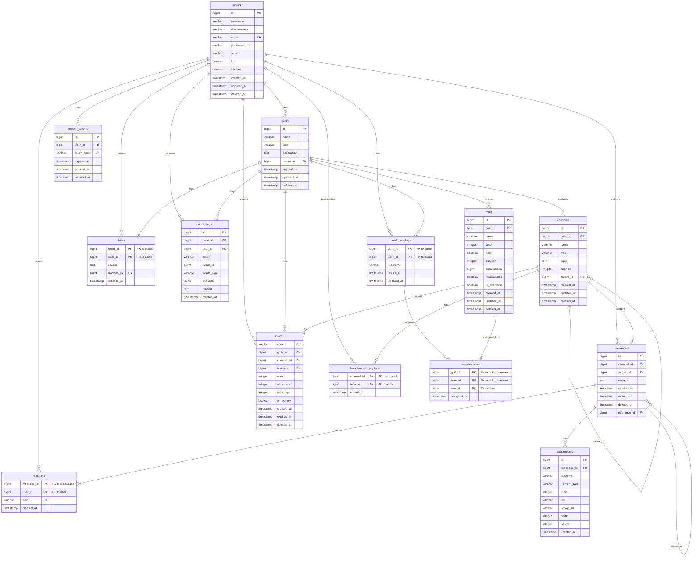

# Database Design Document

## Discord-like Chat Server - PostgreSQL Schema

**Version:** 1.0
**Last Updated:** 2024-12-12
**Database:** PostgreSQL 15+

---

## Table of Contents

1. [Overview](#overview)
2. [Design Principles](#design-principles)
3. [Entity Relationship Diagram](#entity-relationship-diagram)
4. [ID Generation Strategy](#id-generation-strategy)
5. [Custom Types](#custom-types)
6. [Table Specifications](#table-specifications)
7. [Permission System](#permission-system)
8. [Index Strategy](#index-strategy)
9. [Common Query Patterns](#common-query-patterns)
10. [Migration Strategy](#migration-strategy)
11. [Performance Considerations](#performance-considerations)

---

## Overview

This document describes the PostgreSQL database schema for a Discord-like chat server. The schema supports:

- **Users and Authentication**: User accounts, bot accounts, JWT refresh tokens
- **Guilds (Servers)**: Community containers with hierarchical channels
- **Channels**: Text channels, categories, and direct messages
- **Messages**: Text messages with reactions and attachments
- **Roles and Permissions**: Role-based access control with bitfield permissions
- **Moderation**: Bans, audit logs, and soft deletes

### Target Scale
- Initial: 1K-10K users
- Designed for horizontal scaling
- Single PostgreSQL instance for MVP

### Key Design Decisions
- **Snowflake IDs**: 64-bit BIGINT for all primary keys (Discord-compatible)
- **Soft Deletes**: `deleted_at` timestamp instead of hard deletes
- **Adjacency List**: Channel hierarchy via `parent_id`
- **Consistency over Availability**: ACID compliance prioritized

---

## Design Principles

### Naming Conventions

| Element | Convention | Example |
|---------|------------|---------|
| Tables | lowercase, plural, snake_case | `guild_members`, `audit_logs` |
| Columns | lowercase, snake_case | `created_at`, `is_everyone` |
| Primary Keys | `id` (BIGINT) | `id BIGINT PRIMARY KEY` |
| Foreign Keys | `{table_singular}_id` | `user_id`, `guild_id` |
| Indexes | `idx_{table}_{columns}` | `idx_messages_channel_id` |
| Constraints | `{table}_{type}_{desc}` | `users_uq_email` |

### Data Type Selection

| Use Case | Type | Rationale |
|----------|------|-----------|
| IDs | `BIGINT` | Snowflake IDs, 64-bit compatible |
| Timestamps | `TIMESTAMPTZ` | Always timezone-aware |
| Text (unbounded) | `TEXT` | No artificial limits |
| Text (bounded) | `VARCHAR(n)` | When limit is business rule |
| Permissions | `BIGINT` | Bitfield for 64 flags |
| Colors | `INTEGER` | RGB as 24-bit integer |
| Metadata | `JSONB` | Audit log changes |

### Soft Delete Pattern

All major entities support soft deletion:

```sql
deleted_at TIMESTAMPTZ  -- NULL = active, timestamp = deleted
```

Queries filter with `WHERE deleted_at IS NULL` and partial indexes exclude deleted rows.

---

## Entity Relationship Diagram



---

## ID Generation Strategy

### Snowflake IDs

All primary keys use **Snowflake IDs** - 64-bit integers that encode creation time:

```
 64 bits total
+----------------+----------+------------+
|   Timestamp    | Shard ID | Sequence   |
|   (42 bits)    | (10 bits)| (12 bits)  |
+----------------+----------+------------+
```

**Benefits:**
- Globally unique without coordination
- Time-sortable (roughly chronological order)
- Embeds creation timestamp
- Discord-compatible format

**Implementation:**

```sql
-- Snowflake ID generation function
CREATE OR REPLACE FUNCTION generate_snowflake_id(
    shard_id INTEGER DEFAULT 1,
    epoch BIGINT DEFAULT 1704067200000  -- 2024-01-01 00:00:00 UTC
) RETURNS BIGINT AS $$
DECLARE
    current_ms BIGINT;
    seq_id BIGINT;
    result BIGINT;
BEGIN
    current_ms := (EXTRACT(EPOCH FROM clock_timestamp()) * 1000)::BIGINT - epoch;
    seq_id := nextval('snowflake_sequence') % 4096;
    result := (current_ms << 22) | ((shard_id % 1024) << 12) | seq_id;
    RETURN result;
END;
$$ LANGUAGE plpgsql;

CREATE SEQUENCE IF NOT EXISTS snowflake_sequence;
```

**Extracting Timestamp:**

```sql
-- Extract creation time from Snowflake ID
SELECT to_timestamp(((id >> 22) + 1704067200000) / 1000.0) AS created_at
FROM messages WHERE id = ?;
```

### ID Generation in Application

For better performance, generate Snowflake IDs in the Rust application layer using a library like `snowflake-rs` or custom implementation. Database function serves as fallback.

---

## Custom Types

### ENUM Types

```sql
-- Channel types
CREATE TYPE channel_type AS ENUM (
    'text',      -- Standard text channel
    'category',  -- Channel category/folder
    'dm'         -- Direct message channel
);

-- User presence status
CREATE TYPE presence_status AS ENUM (
    'online',    -- Active and available
    'idle',      -- AFK or inactive
    'dnd',       -- Do Not Disturb
    'offline'    -- Disconnected
);

-- Audit log action types
CREATE TYPE audit_action AS ENUM (
    'guild_update',
    'channel_create',
    'channel_update',
    'channel_delete',
    'role_create',
    'role_update',
    'role_delete',
    'member_kick',
    'member_ban',
    'member_unban',
    'member_role_update',
    'message_delete'
);
```

### Future ENUM Extensions

When adding new enum values, use:

```sql
ALTER TYPE channel_type ADD VALUE 'voice' AFTER 'text';
ALTER TYPE channel_type ADD VALUE 'announcement' AFTER 'voice';
```

Note: Enum values cannot be removed in PostgreSQL. Plan carefully.

---

## Table Specifications

### users

Platform user accounts including bots.

| Column | Type | Nullable | Default | Description |
|--------|------|----------|---------|-------------|
| id | BIGINT | NO | - | Snowflake ID |
| username | VARCHAR(32) | NO | - | Display name |
| discriminator | VARCHAR(4) | NO | '0001' | 4-digit tag |
| email | VARCHAR(255) | NO | - | Unique email |
| password_hash | VARCHAR(255) | NO | - | Argon2 hash |
| avatar | VARCHAR(255) | YES | NULL | Avatar URL/hash |
| bot | BOOLEAN | NO | FALSE | Is bot account |
| system | BOOLEAN | NO | FALSE | Is system account |
| created_at | TIMESTAMPTZ | NO | NOW() | Creation time |
| updated_at | TIMESTAMPTZ | NO | NOW() | Last update |
| deleted_at | TIMESTAMPTZ | YES | NULL | Soft delete |

**Constraints:**
- `users_username_discriminator_unique`: UNIQUE(username, discriminator)
- `users_email_key`: UNIQUE(email)

---

### guilds

Servers/communities (Discord calls these "servers").

| Column | Type | Nullable | Default | Description |
|--------|------|----------|---------|-------------|
| id | BIGINT | NO | - | Snowflake ID |
| name | VARCHAR(100) | NO | - | Guild name |
| icon | VARCHAR(255) | YES | NULL | Icon URL/hash |
| description | TEXT | YES | NULL | Guild description |
| owner_id | BIGINT | NO | - | FK to users |
| created_at | TIMESTAMPTZ | NO | NOW() | Creation time |
| updated_at | TIMESTAMPTZ | NO | NOW() | Last update |
| deleted_at | TIMESTAMPTZ | YES | NULL | Soft delete |

**Constraints:**
- FK `owner_id` -> `users(id)`

**Triggers:**
- `create_guild_everyone_role`: Auto-creates @everyone role

---

### channels

Text channels, categories, and DM channels.

| Column | Type | Nullable | Default | Description |
|--------|------|----------|---------|-------------|
| id | BIGINT | NO | - | Snowflake ID |
| guild_id | BIGINT | YES | NULL | FK to guilds (NULL for DMs) |
| name | VARCHAR(100) | YES | NULL | Channel name (NULL for DMs) |
| type | channel_type | NO | 'text' | Channel type |
| topic | TEXT | YES | NULL | Channel topic/description |
| position | INTEGER | NO | 0 | Display order |
| parent_id | BIGINT | YES | NULL | FK to channels (category) |
| created_at | TIMESTAMPTZ | NO | NOW() | Creation time |
| updated_at | TIMESTAMPTZ | NO | NOW() | Last update |
| deleted_at | TIMESTAMPTZ | YES | NULL | Soft delete |

**Constraints:**
- FK `guild_id` -> `guilds(id)`
- FK `parent_id` -> `channels(id)` (adjacency list)
- `channels_category_no_parent`: Categories cannot have parents

---

### messages

Text messages in channels.

| Column | Type | Nullable | Default | Description |
|--------|------|----------|---------|-------------|
| id | BIGINT | NO | - | Snowflake ID |
| channel_id | BIGINT | NO | - | FK to channels |
| author_id | BIGINT | NO | - | FK to users |
| content | TEXT | NO | - | Message text |
| created_at | TIMESTAMPTZ | NO | NOW() | Creation time |
| edited_at | TIMESTAMPTZ | YES | NULL | Last edit time |
| deleted_at | TIMESTAMPTZ | YES | NULL | Soft delete |
| reference_id | BIGINT | YES | NULL | Reply reference |

**Constraints:**
- FK `channel_id` -> `channels(id)`
- FK `author_id` -> `users(id)`
- FK `reference_id` -> `messages(id)`

---

### roles

Permission roles within a guild.

| Column | Type | Nullable | Default | Description |
|--------|------|----------|---------|-------------|
| id | BIGINT | NO | - | Snowflake ID |
| guild_id | BIGINT | NO | - | FK to guilds |
| name | VARCHAR(100) | NO | - | Role name |
| color | INTEGER | NO | 0 | RGB color |
| hoist | BOOLEAN | NO | FALSE | Display separately |
| position | INTEGER | NO | 0 | Hierarchy position |
| permissions | BIGINT | NO | 0 | Permission bitfield |
| mentionable | BOOLEAN | NO | FALSE | Can be mentioned |
| is_everyone | BOOLEAN | NO | FALSE | Is @everyone role |
| created_at | TIMESTAMPTZ | NO | NOW() | Creation time |
| updated_at | TIMESTAMPTZ | NO | NOW() | Last update |
| deleted_at | TIMESTAMPTZ | YES | NULL | Soft delete |

**Constraints:**
- FK `guild_id` -> `guilds(id)` ON DELETE CASCADE
- `roles_one_everyone_per_guild`: Partial unique on (guild_id, is_everyone)

---

### guild_members

User membership in guilds.

| Column | Type | Nullable | Default | Description |
|--------|------|----------|---------|-------------|
| guild_id | BIGINT | NO | - | FK to guilds |
| user_id | BIGINT | NO | - | FK to users |
| nickname | VARCHAR(32) | YES | NULL | Server nickname |
| joined_at | TIMESTAMPTZ | NO | NOW() | Join time |
| updated_at | TIMESTAMPTZ | NO | NOW() | Last update |

**Constraints:**
- PK (guild_id, user_id)
- FK `guild_id` -> `guilds(id)` ON DELETE CASCADE
- FK `user_id` -> `users(id)`

---

### member_roles

Role assignments for guild members.

| Column | Type | Nullable | Default | Description |
|--------|------|----------|---------|-------------|
| guild_id | BIGINT | NO | - | FK to guild_members |
| user_id | BIGINT | NO | - | FK to guild_members |
| role_id | BIGINT | NO | - | FK to roles |
| assigned_at | TIMESTAMPTZ | NO | NOW() | Assignment time |

**Constraints:**
- PK (guild_id, user_id, role_id)
- FK (guild_id, user_id) -> `guild_members` ON DELETE CASCADE
- FK `role_id` -> `roles(id)` ON DELETE CASCADE

---

### reactions

Emoji reactions on messages.

| Column | Type | Nullable | Default | Description |
|--------|------|----------|---------|-------------|
| message_id | BIGINT | NO | - | FK to messages |
| user_id | BIGINT | NO | - | FK to users |
| emoji | VARCHAR(64) | NO | - | Unicode or custom ID |
| created_at | TIMESTAMPTZ | NO | NOW() | Reaction time |

**Constraints:**
- PK (message_id, user_id, emoji)
- FK `message_id` -> `messages(id)` ON DELETE CASCADE
- FK `user_id` -> `users(id)`

---

### attachments

File attachments on messages.

| Column | Type | Nullable | Default | Description |
|--------|------|----------|---------|-------------|
| id | BIGINT | NO | - | Snowflake ID |
| message_id | BIGINT | NO | - | FK to messages |
| filename | VARCHAR(255) | NO | - | Original filename |
| content_type | VARCHAR(100) | NO | - | MIME type |
| size | INTEGER | NO | - | File size in bytes |
| url | VARCHAR(512) | NO | - | Storage URL |
| proxy_url | VARCHAR(512) | YES | NULL | CDN proxy URL |
| width | INTEGER | YES | NULL | Image width |
| height | INTEGER | YES | NULL | Image height |
| created_at | TIMESTAMPTZ | NO | NOW() | Upload time |

**Constraints:**
- FK `message_id` -> `messages(id)` ON DELETE CASCADE

---

### invites

Guild invitation links.

| Column | Type | Nullable | Default | Description |
|--------|------|----------|---------|-------------|
| code | VARCHAR(16) | NO | - | Invite code (PK) |
| guild_id | BIGINT | NO | - | FK to guilds |
| channel_id | BIGINT | NO | - | FK to channels |
| inviter_id | BIGINT | NO | - | FK to users |
| uses | INTEGER | NO | 0 | Current use count |
| max_uses | INTEGER | YES | NULL | Max uses (NULL=unlimited) |
| max_age | INTEGER | YES | NULL | Seconds until expire |
| temporary | BOOLEAN | NO | FALSE | Grant temporary membership |
| created_at | TIMESTAMPTZ | NO | NOW() | Creation time |
| expires_at | TIMESTAMPTZ | YES | NULL | Expiration time |
| deleted_at | TIMESTAMPTZ | YES | NULL | Soft delete |

**Constraints:**
- FK `guild_id` -> `guilds(id)` ON DELETE CASCADE
- FK `channel_id` -> `channels(id)`
- FK `inviter_id` -> `users(id)`

---

### bans

Banned users per guild.

| Column | Type | Nullable | Default | Description |
|--------|------|----------|---------|-------------|
| guild_id | BIGINT | NO | - | FK to guilds |
| user_id | BIGINT | NO | - | FK to users |
| reason | TEXT | YES | NULL | Ban reason |
| banned_by | BIGINT | NO | - | FK to users (moderator) |
| created_at | TIMESTAMPTZ | NO | NOW() | Ban time |

**Constraints:**
- PK (guild_id, user_id)
- FK `guild_id` -> `guilds(id)` ON DELETE CASCADE
- FK `user_id` -> `users(id)`
- FK `banned_by` -> `users(id)`

---

### audit_logs

Moderation action audit trail.

| Column | Type | Nullable | Default | Description |
|--------|------|----------|---------|-------------|
| id | BIGINT | NO | - | Snowflake ID |
| guild_id | BIGINT | NO | - | FK to guilds |
| user_id | BIGINT | NO | - | FK to users (actor) |
| action | audit_action | NO | - | Action type |
| target_id | BIGINT | YES | NULL | Affected entity ID |
| target_type | VARCHAR(50) | YES | NULL | Entity type name |
| changes | JSONB | YES | NULL | Before/after values |
| reason | TEXT | YES | NULL | Action reason |
| created_at | TIMESTAMPTZ | NO | NOW() | Action time |

**Constraints:**
- FK `guild_id` -> `guilds(id)` ON DELETE CASCADE
- FK `user_id` -> `users(id)`

**Changes JSONB Format:**
```json
{
  "name": {"old": "general", "new": "main-chat"},
  "topic": {"old": null, "new": "Welcome!"}
}
```

---

### refresh_tokens

JWT refresh token storage.

| Column | Type | Nullable | Default | Description |
|--------|------|----------|---------|-------------|
| id | BIGINT | NO | - | Snowflake ID |
| user_id | BIGINT | NO | - | FK to users |
| token_hash | VARCHAR(255) | NO | - | SHA-256 hash |
| expires_at | TIMESTAMPTZ | NO | - | Expiration time |
| created_at | TIMESTAMPTZ | NO | NOW() | Creation time |
| revoked_at | TIMESTAMPTZ | YES | NULL | Revocation time |

**Constraints:**
- FK `user_id` -> `users(id)` ON DELETE CASCADE
- UNIQUE(token_hash)

---

### dm_channel_recipients

Participants in DM/Group DM channels.

| Column | Type | Nullable | Default | Description |
|--------|------|----------|---------|-------------|
| channel_id | BIGINT | NO | - | FK to channels |
| user_id | BIGINT | NO | - | FK to users |
| created_at | TIMESTAMPTZ | NO | NOW() | Join time |

**Constraints:**
- PK (channel_id, user_id)
- FK `channel_id` -> `channels(id)` ON DELETE CASCADE
- FK `user_id` -> `users(id)`

---

## Permission System

### Permission Bitfield

Permissions are stored as a 64-bit integer bitfield in `roles.permissions`:

| Bit | Value | Permission | Description |
|-----|-------|------------|-------------|
| 0 | 1 | VIEW_CHANNEL | View channels |
| 1 | 2 | SEND_MESSAGES | Send messages |
| 2 | 4 | MANAGE_MESSAGES | Delete others' messages |
| 3 | 8 | MANAGE_CHANNELS | Create/edit/delete channels |
| 4 | 16 | MANAGE_ROLES | Create/edit/delete roles |
| 5 | 32 | MANAGE_GUILD | Edit guild settings |
| 6 | 64 | KICK_MEMBERS | Kick members |
| 7 | 128 | BAN_MEMBERS | Ban members |
| 8 | 256 | ADMINISTRATOR | All permissions |
| 9 | 512 | ATTACH_FILES | Upload files |
| 10 | 1024 | ADD_REACTIONS | Add reactions |

### Permission Resolution (MVP)

Simplified resolution without channel overwrites:

```rust
fn compute_permissions(member_roles: &[Role]) -> u64 {
    let mut permissions = 0u64;

    for role in member_roles {
        permissions |= role.permissions;
    }

    // ADMINISTRATOR grants all permissions
    if (permissions & ADMINISTRATOR) != 0 {
        return ALL_PERMISSIONS;
    }

    permissions
}
```

### Permission Check Helpers

```sql
-- Check if user has specific permission in guild
CREATE OR REPLACE FUNCTION has_permission(
    p_user_id BIGINT,
    p_guild_id BIGINT,
    p_permission BIGINT
) RETURNS BOOLEAN AS $$
DECLARE
    v_permissions BIGINT;
BEGIN
    -- Get combined permissions from all roles
    SELECT COALESCE(BIT_OR(r.permissions), 0)
    INTO v_permissions
    FROM member_roles mr
    JOIN roles r ON r.id = mr.role_id
    WHERE mr.guild_id = p_guild_id
      AND mr.user_id = p_user_id
      AND r.deleted_at IS NULL;

    -- Also include @everyone role
    SELECT v_permissions | COALESCE(r.permissions, 0)
    INTO v_permissions
    FROM roles r
    WHERE r.guild_id = p_guild_id
      AND r.is_everyone = TRUE
      AND r.deleted_at IS NULL;

    -- ADMINISTRATOR bypasses all checks
    IF (v_permissions & 256) != 0 THEN
        RETURN TRUE;
    END IF;

    RETURN (v_permissions & p_permission) = p_permission;
END;
$$ LANGUAGE plpgsql STABLE;
```

### Default Permissions

@everyone role default: `VIEW_CHANNEL | SEND_MESSAGES | ADD_REACTIONS | ATTACH_FILES`
```sql
(1 | 2 | 1024 | 512) = 1539
```

---

## Index Strategy

### Index Types Used

| Type | Use Case | Tables |
|------|----------|--------|
| B-tree | Equality, range, ORDER BY | Most columns |
| GIN | Full-text search | messages.content |
| Partial | Filter deleted rows | Most tables |

### Index Inventory

#### users
```sql
idx_users_email          ON users(email) WHERE deleted_at IS NULL
idx_users_username       ON users(username) WHERE deleted_at IS NULL
idx_users_bot            ON users(bot) WHERE deleted_at IS NULL
```

#### guilds
```sql
idx_guilds_owner         ON guilds(owner_id) WHERE deleted_at IS NULL
idx_guilds_name          ON guilds(name) WHERE deleted_at IS NULL
```

#### channels
```sql
idx_channels_guild       ON channels(guild_id) WHERE deleted_at IS NULL
idx_channels_parent      ON channels(parent_id) WHERE deleted_at IS NULL
idx_channels_type        ON channels(type) WHERE deleted_at IS NULL
```

#### messages
```sql
idx_messages_channel_id  ON messages(channel_id, id DESC) WHERE deleted_at IS NULL
idx_messages_author      ON messages(author_id) WHERE deleted_at IS NULL
idx_messages_content_search ON messages USING gin(to_tsvector('english', content))
                           WHERE deleted_at IS NULL
idx_messages_cursor      ON messages(channel_id, id) WHERE deleted_at IS NULL
```

#### roles
```sql
idx_roles_guild          ON roles(guild_id) WHERE deleted_at IS NULL
idx_roles_position       ON roles(guild_id, position) WHERE deleted_at IS NULL
```

#### guild_members
```sql
idx_members_user         ON guild_members(user_id)
idx_members_joined       ON guild_members(guild_id, joined_at)
idx_guild_members_user_guilds ON guild_members(user_id, joined_at DESC)
```

#### member_roles
```sql
idx_member_roles_role         ON member_roles(role_id)
idx_member_roles_permissions  ON member_roles(guild_id, user_id)
```

#### reactions
```sql
idx_reactions_message    ON reactions(message_id)
idx_reactions_user       ON reactions(user_id)
```

#### attachments
```sql
idx_attachments_message  ON attachments(message_id)
```

#### invites
```sql
idx_invites_guild        ON invites(guild_id) WHERE deleted_at IS NULL
idx_invites_expires      ON invites(expires_at) WHERE deleted_at IS NULL
```

#### bans
```sql
idx_bans_user            ON bans(user_id)
```

#### audit_logs
```sql
idx_audit_logs_guild     ON audit_logs(guild_id, created_at DESC)
idx_audit_logs_user      ON audit_logs(user_id)
idx_audit_logs_action    ON audit_logs(action)
```

#### refresh_tokens
```sql
idx_refresh_tokens_user     ON refresh_tokens(user_id)
idx_refresh_tokens_expires  ON refresh_tokens(expires_at) WHERE revoked_at IS NULL
```

#### dm_channel_recipients
```sql
idx_dm_recipients_user   ON dm_channel_recipients(user_id)
```

### Index Design Rationale

1. **Message Pagination**: `idx_messages_channel_id` with `(channel_id, id DESC)` enables efficient cursor-based pagination using Snowflake IDs.

2. **Partial Indexes**: All `WHERE deleted_at IS NULL` indexes exclude soft-deleted rows, reducing index size and improving query performance.

3. **Full-Text Search**: GIN index on `to_tsvector('english', content)` enables efficient text search.

4. **Composite Indexes**: Column order follows equality-first, then range/sort columns.

---

## Common Query Patterns

### Message Pagination (Cursor-based)

```sql
-- Get messages before cursor (scrolling up)
SELECT m.id, m.content, m.author_id, m.created_at, m.edited_at,
       u.username, u.discriminator, u.avatar
FROM messages m
JOIN users u ON u.id = m.author_id
WHERE m.channel_id = $1
  AND m.deleted_at IS NULL
  AND m.id < $2  -- cursor (Snowflake ID)
ORDER BY m.id DESC
LIMIT 50;

-- Get messages after cursor (scrolling down)
SELECT m.id, m.content, m.author_id, m.created_at, m.edited_at,
       u.username, u.discriminator, u.avatar
FROM messages m
JOIN users u ON u.id = m.author_id
WHERE m.channel_id = $1
  AND m.deleted_at IS NULL
  AND m.id > $2  -- cursor
ORDER BY m.id ASC
LIMIT 50;
```

### Get User's Guilds

```sql
SELECT g.id, g.name, g.icon, g.owner_id,
       gm.nickname, gm.joined_at
FROM guilds g
JOIN guild_members gm ON gm.guild_id = g.id
WHERE gm.user_id = $1
  AND g.deleted_at IS NULL
ORDER BY gm.joined_at DESC;
```

### Get Guild Members with Roles

```sql
SELECT
    gm.user_id,
    u.username,
    u.discriminator,
    u.avatar,
    gm.nickname,
    gm.joined_at,
    COALESCE(array_agg(mr.role_id) FILTER (WHERE mr.role_id IS NOT NULL), '{}') AS role_ids
FROM guild_members gm
JOIN users u ON u.id = gm.user_id
LEFT JOIN member_roles mr ON mr.guild_id = gm.guild_id AND mr.user_id = gm.user_id
WHERE gm.guild_id = $1
  AND u.deleted_at IS NULL
GROUP BY gm.user_id, u.username, u.discriminator, u.avatar, gm.nickname, gm.joined_at
ORDER BY gm.joined_at;
```

### Compute User Permissions

```sql
SELECT COALESCE(BIT_OR(r.permissions), 0) AS permissions
FROM (
    -- User's assigned roles
    SELECT r.permissions
    FROM member_roles mr
    JOIN roles r ON r.id = mr.role_id
    WHERE mr.guild_id = $1
      AND mr.user_id = $2
      AND r.deleted_at IS NULL

    UNION ALL

    -- @everyone role
    SELECT r.permissions
    FROM roles r
    WHERE r.guild_id = $1
      AND r.is_everyone = TRUE
      AND r.deleted_at IS NULL
) r;
```

### Get Channel Hierarchy

```sql
-- All channels in guild with category info
SELECT c.id, c.name, c.type, c.topic, c.position,
       c.parent_id,
       pc.name AS category_name
FROM channels c
LEFT JOIN channels pc ON pc.id = c.parent_id
WHERE c.guild_id = $1
  AND c.deleted_at IS NULL
ORDER BY
    COALESCE(c.parent_id, c.id),  -- Categories first, then their children
    c.type = 'category' DESC,     -- Category before its children
    c.position;
```

### Full-Text Message Search

```sql
SELECT m.id, m.content, m.channel_id, m.created_at,
       ts_headline('english', m.content, q, 'StartSel=<mark>, StopSel=</mark>') AS highlight
FROM messages m,
     to_tsquery('english', $2) q
WHERE m.channel_id = $1
  AND m.deleted_at IS NULL
  AND to_tsvector('english', m.content) @@ q
ORDER BY ts_rank(to_tsvector('english', m.content), q) DESC
LIMIT 50;
```

### Get User's DM Channels

```sql
SELECT c.id, c.created_at,
       array_agg(json_build_object(
           'id', u.id,
           'username', u.username,
           'discriminator', u.discriminator,
           'avatar', u.avatar
       )) AS recipients
FROM channels c
JOIN dm_channel_recipients r ON r.channel_id = c.id
JOIN users u ON u.id = r.user_id
WHERE c.type = 'dm'
  AND c.deleted_at IS NULL
  AND c.id IN (
      SELECT channel_id FROM dm_channel_recipients WHERE user_id = $1
  )
GROUP BY c.id, c.created_at
ORDER BY c.created_at DESC;
```

### Find or Create DM Channel

```sql
-- Find existing DM between two users
SELECT c.id
FROM channels c
JOIN dm_channel_recipients r1 ON r1.channel_id = c.id AND r1.user_id = $1
JOIN dm_channel_recipients r2 ON r2.channel_id = c.id AND r2.user_id = $2
WHERE c.type = 'dm'
  AND c.deleted_at IS NULL
  AND (
      SELECT COUNT(*) FROM dm_channel_recipients WHERE channel_id = c.id
  ) = 2;
```

---

## Migration Strategy

### Principles

1. **Always Reversible**: Every migration has UP and DOWN
2. **Zero-Downtime**: No table locks during production
3. **Incremental**: Small, focused changes
4. **Tested**: Validate on staging first

### File Naming Convention

```
migrations/
  001_initial_schema.up.sql
  001_initial_schema.down.sql
  002_add_voice_channels.up.sql
  002_add_voice_channels.down.sql
```

### Zero-Downtime Patterns

#### Adding a Column

```sql
-- UP: Add nullable column first
ALTER TABLE users ADD COLUMN phone VARCHAR(20);

-- Later: Backfill data
UPDATE users SET phone = '' WHERE phone IS NULL;

-- Finally: Add NOT NULL (if needed)
ALTER TABLE users ALTER COLUMN phone SET NOT NULL;
```

#### Adding an Index

```sql
-- Always use CONCURRENTLY to avoid table locks
CREATE INDEX CONCURRENTLY idx_users_phone ON users(phone);
```

#### Adding a Foreign Key

```sql
-- Step 1: Add column
ALTER TABLE messages ADD COLUMN thread_id BIGINT;

-- Step 2: Create index
CREATE INDEX CONCURRENTLY idx_messages_thread ON messages(thread_id);

-- Step 3: Add constraint as NOT VALID (doesn't check existing rows)
ALTER TABLE messages
    ADD CONSTRAINT messages_thread_fk
    FOREIGN KEY (thread_id) REFERENCES threads(id) NOT VALID;

-- Step 4: Validate constraint (allows concurrent reads/writes)
ALTER TABLE messages VALIDATE CONSTRAINT messages_thread_fk;
```

#### Adding Enum Values

```sql
-- Add new enum value (cannot be undone!)
ALTER TYPE channel_type ADD VALUE 'voice' AFTER 'text';
```

### Migration Safety Checklist

- [ ] Set lock_timeout before operations
- [ ] Use CONCURRENTLY for index creation
- [ ] Batch UPDATE/DELETE for large data changes
- [ ] Test rollback procedure
- [ ] Verify foreign key validity
- [ ] Check index usage with EXPLAIN

### Sample Migration Template

```sql
-- migrations/003_add_threads.up.sql
BEGIN;

-- Set timeouts to fail fast rather than wait
SET lock_timeout = '5s';
SET statement_timeout = '30s';

-- Add new table
CREATE TABLE threads (
    id BIGINT PRIMARY KEY,
    channel_id BIGINT NOT NULL REFERENCES channels(id),
    message_id BIGINT NOT NULL REFERENCES messages(id),
    name VARCHAR(100),
    created_at TIMESTAMPTZ NOT NULL DEFAULT NOW()
);

COMMENT ON TABLE threads IS 'Message threads for threaded conversations';

COMMIT;
```

```sql
-- migrations/003_add_threads.down.sql
BEGIN;

DROP TABLE IF EXISTS threads;

COMMIT;
```

---

## Performance Considerations

### Connection Pooling

Use PgBouncer or built-in connection pooling:
- Pool size: 20-50 connections per app instance
- Transaction mode recommended

### Query Optimization Tips

1. **Use EXPLAIN ANALYZE** for all new queries
2. **Avoid SELECT ***: Specify only needed columns
3. **Batch inserts**: Use multi-row INSERT
4. **Use prepared statements**: Reduce parse overhead

### Scaling Strategies

#### Read Replicas
- Route read queries (message history, member list) to replicas
- Keep writes on primary

#### Table Partitioning (Future)

For messages table when it grows large:

```sql
-- Partition by month using Snowflake ID range
CREATE TABLE messages (
    id BIGINT NOT NULL,
    channel_id BIGINT NOT NULL,
    -- ...
) PARTITION BY RANGE (id);

-- Create monthly partitions
CREATE TABLE messages_2024_01 PARTITION OF messages
    FOR VALUES FROM (snowflake_min('2024-01-01')) TO (snowflake_min('2024-02-01'));
```

#### Sharding (Future)

Guild-based sharding when single instance is insufficient:
- Shard key: `guild_id`
- Co-locate all guild data on same shard
- Cross-guild queries (user's guilds) hit all shards

### Monitoring Queries

```sql
-- Slow queries
SELECT query, calls, mean_time, total_time
FROM pg_stat_statements
ORDER BY mean_time DESC
LIMIT 20;

-- Index usage
SELECT schemaname, tablename, indexname, idx_scan, idx_tup_read
FROM pg_stat_user_indexes
ORDER BY idx_scan;

-- Table sizes
SELECT relname, pg_size_pretty(pg_total_relation_size(relid))
FROM pg_stat_user_tables
ORDER BY pg_total_relation_size(relid) DESC;
```

---

## Appendix A: Views

### active_users
```sql
SELECT * FROM users WHERE deleted_at IS NULL;
```

### active_guilds
```sql
SELECT * FROM guilds WHERE deleted_at IS NULL;
```

### active_channels
```sql
SELECT * FROM channels WHERE deleted_at IS NULL;
```

### active_messages
```sql
SELECT * FROM messages WHERE deleted_at IS NULL;
```

### member_with_roles
```sql
SELECT
    gm.guild_id, gm.user_id, u.username, u.discriminator, u.avatar,
    gm.nickname, gm.joined_at,
    COALESCE(array_agg(mr.role_id) FILTER (WHERE mr.role_id IS NOT NULL), '{}') AS role_ids
FROM guild_members gm
JOIN users u ON u.id = gm.user_id
LEFT JOIN member_roles mr ON mr.guild_id = gm.guild_id AND mr.user_id = gm.user_id
WHERE u.deleted_at IS NULL
GROUP BY gm.guild_id, gm.user_id, u.username, u.discriminator, u.avatar, gm.nickname, gm.joined_at;
```

---

## Appendix B: Triggers

### update_updated_at_column()

Auto-updates `updated_at` on row modification:

```sql
CREATE OR REPLACE FUNCTION update_updated_at_column()
RETURNS TRIGGER AS $$
BEGIN
    NEW.updated_at = NOW();
    RETURN NEW;
END;
$$ LANGUAGE plpgsql;
```

Applied to: `users`, `guilds`, `channels`, `roles`, `guild_members`

### create_everyone_role()

Auto-creates @everyone role when guild is created:

```sql
CREATE OR REPLACE FUNCTION create_everyone_role()
RETURNS TRIGGER AS $$
BEGIN
    INSERT INTO roles (id, guild_id, name, permissions, is_everyone, position)
    VALUES (NEW.id, NEW.id, '@everyone', 1539, TRUE, 0);
    RETURN NEW;
END;
$$ LANGUAGE plpgsql;
```

---

## Appendix C: Future Extensions

### Voice Channels
- Add `voice` to channel_type enum
- New tables: `voice_states`, `voice_regions`

### Threads
- New table: `threads`
- Update messages with `thread_id` FK

### Server Boosts
- New tables: `boosts`, `boost_tiers`
- Guild premium features

### Webhooks
- New table: `webhooks`
- Webhook message delivery

### Scheduled Events
- New table: `guild_scheduled_events`
- Event RSVPs and reminders
